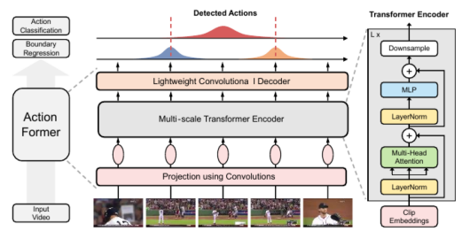
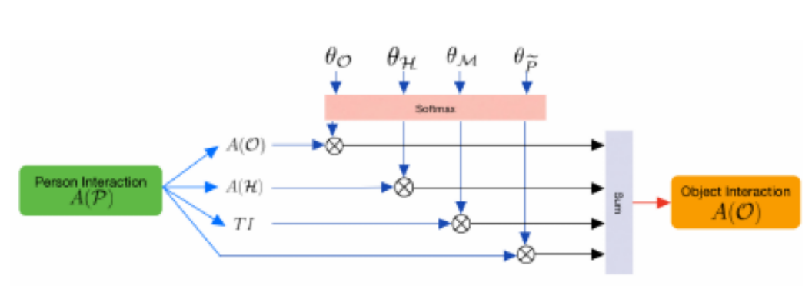
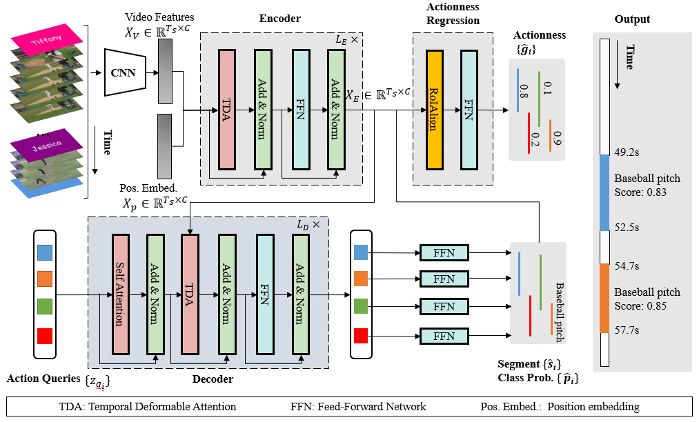

**時間的行動定位(****Temporal Action Localization****)**** 調査**** **** **
作成：2022/11/7  
ネクストシステム 古林  

  * 弱教師付き時間アクションローカリゼーションのためのバックグラウンド抑制ネットワーク  
  Suppression Network for Weakly-supervised Temporal Action Localization
  
  
  この論文の特徴は動画をRGBとオプティカルフローに分けて扱う事です。
  行動定位の課題として背景画面の取り扱いがありますが。ここでは抑制ブランチ側にフィルタを設けて背景フレームからの活性化を抑制するよう学習するようです。このようなアーキテクチャを非対称トレーニング戦略と呼び、2ブランチの重み共有アーキテクチャを持つバックグラウンド抑制ネットワーク（BaS-Net）を提案しています。
  
  論文URL： [https://arxiv.org/abs/1911.09963](https://arxiv.org/abs/1911.09963)  
  採択された学会：AAAI2020(アメリカ人工知能学会)  
  論文引用数：121  
  PaperWithCodeでの順位：６位　時間的行動定位部門　ActivityNet-1.3データベース  
  GitHubのコードのURL：https://github.com/Pilhyeon/BaSNet-pytorch  
  著者：Xiaolong Liu, Qimeng Wang, Yao Hu, Xu Tang, Shiwei Zhang, Song Bai, and Xiang Bai, Senior Member, IEEE  
  
  ***

  * ActionFormer：トランスフォーマーによるアクションの瞬間のローカライズ  
  ActionFormer：Localizing Moments of Actions with Transformers
  
  
  本論文はTransformer ベースのモデルを利用し、各瞬間を分類し、アクションの境界を推定することで、
  アクションインスタンスを検出するらしいです。まずビデオクリップの特徴量(I3D)のシーケンスを抽出し、これらの各特徴量をマルチスケールトランスフォーマーにより特徴ピラミッドに変換し、特徴ピラミッドを分類器と回帰器が共有して、時間ステップごとに行動候補を生成するらしいです。
  尚GitHubの実装は動画入力ではなくTHUMOS’14の計算済みI3d特徴量で、出力はテストデータのみとなっております。
  
  論文URL： [2202.07925.pdf (arxiv.org)](https://arxiv.org/pdf/2202.07925.pdf)
  採択された学会：European Conference on Computer Vision, 2022
  論文引用数：18
  PaperWithCodeでの順位：1位　時間的行動定位部門　THUMOS’14データベース
  GitHubのコードのURL： [http://github.com/happyharrycn/actionformer_release](http://github.com/happyharrycn/actionformer_release)
  著者：Chen-Lin Zhang, Jianxin Wu, and Yin Li, State Key Laboratory for Novel Software Technology, Nanjing University, China Paradigm Inc, Beijing, China, University of Wisconsin-Madison, USA  
  ***
  

  * 時間的行動検出のための提案関係ネットワーク  
  Proposal Relation Network for Temporal Action Detection  
  
  
  
  この論文はViViT: A Video Vision Transformerをバックボーンとして利用しています。
  詳細はこちら…  
  [https://ai-scholar.tech/articles/transformer/ongoing](https://ai-scholar.tech/articles/transformer/ongoing)  
  
  バックボーン後はデータ拡張のために時間シフトの概念が用いられているそうです。そのあと提案関係モジュールが続きます。ここでは、対象となる行動の境界を正確に特定するためが自己注視操作を導入して各提案相互の依存関係を求めます。そして最終的に提案＋分類パイプラインに従って、最終的な検出結果を生成しています。提案関連モデルからパイプラインへのつながりの説明が不明瞭に感じました。
  
  論文URL： [https://paperswithcode.com/paper/proposal-relation-network-for-temporal-action](https://paperswithcode.com/paper/proposal-relation-network-for-temporal-action)  
  採択された学会：不明　アリババ・グループの支援を受けています。  
  論文引用数：９  
  PaperWithCodeでの順位：1位　時間的行動定位部門　ActivityNet-1.3データベース  
  GitHubのコードのURL：https://github.com/wangxiang1230/SSTAP   
  著者：Xiang Wang, Zhiwu Qing, Ziyuan Huang, Yutong Feng2, Shiwei Zhang,Jianwen Jiang, Mingqian Tang, Changxin Gao, Nong Sang, Key Laboratory of Image Processing and Intelligent Control School of Artificial Intelligence and Automation, Huazhong University of Science and Technology, Alibaba Group  
  
 *** 
  
  * 行動検出のための全体的相互作用変圧器ネットワーク  
  Holistic Interaction Transformer Network for Action Detection (HIT)  
  
  この論文ではHITネットワークの提案です。ここで言うアクションとは、他の人やオブジェクト、私たちを含む、環境とのインタラクション方法に関するものです。 本論文では,多くの人間の行動に不可欠な手や**ポーズ情報**を活用するマルチモーダルな包括的インタラクショントランスフォーマーネットワーク(HIT)を提案しています。それぞれが個人、オブジェクト、手動のインタラクションを別々にモデル化します。 各サブネットワーク内では、個々の相互作用ユニットを選択的にマージするイントラモダリティアグリゲーションモジュール(IMA)が導入されました。 それぞれのモダリティから得られる特徴は、優れた融合機構(AFM)を用いて結合されます。 最後に、時間的文脈から手がかりを抽出し、キャッシュメモリを用いて発生した動作をよりよく分類します。
  
  
  図 1：この図は、手の特徴がいかに動作の検出に不可欠であるかを例示しています。この図では、フレーム内の人物は2人とも物体と対話しています。しかし、インスタンス検出器では、両者が相互作用している物体（緑色のボックス）を検出できず、代わりに重要でない物体（灰色の破線ボックス）が選択されてしまいます。しかし、手とその間にあるもの（黄色のボックス）をキャプチャすることで、アクター（赤色のボックス）が行っている動作について、より良いアイデアをモデルに与えることができます。「持ち上げる／拾う」（左）、「運ぶ／持つ」（右）。
  
  
  
  
  
  
  
  図2：HITネットワークの概要。RGBストリームの上には3次元CNNバックボーンがあり、映像の特徴を抽出するために使用されます。ポーズエンコーダーは空間変換モデルです。我々は、人物、手、物体の特徴を用いて、両方のサブネットワークから豊富な局所情報を並列に計算します。そして、グローバルな文脈との相互作用をモデル化する前に、注意深い融合モジュールを用いて学習した特徴を結合します。
  
  
  
  図3：インタラクションモジュールの説明図。∗ はモジュール固有の入力を、P e は A（P）の人物特徴、 または A（∗）の前にあるモジュールの出力を指します。
  
  

図 4: Intra-Modality Aggregator(IMA) の説明図。このように、本システムでは、1つのユニットから次のユニットへの特徴量が、まず文脈上の手がかりで補強され、次にフィルタリングされます。

  論文URL： [http://arxiv.org/abs/2210.12686v1](http://arxiv.org/abs/2210.12686v1)  
  採択された学会：不明　マイクロソフトR&amp;D  
  論文引用数：不明　Google Scholar 検索不能  
  PaperWithCodeでの順位：1位　時間的行動定位部門　J-HMDB-21データベース  
  GitHubのコードのURL：https://github.com/joslefaure/hit 　(現在何もアップロードされていません)  
***

  * You Only Watch Once: リアルタイム時空間行動定位に向けた統一的な CNN アーキテクチャ  
  You Only Watch Once: A Unified CNN Architecture for Real-Time Spatiotemporal Action Localization  
  
  
  
  この論文では、ビデオストリーム中の時空間行動定位をリアルタイムで行うための統一的なCNNアーキテクチャであるYOWOを紹介しています。YOWOは、時間情報と空間情報を同時に抽出する2つのブランチを持つ1段のアーキテクチャであり、そのブランチから予測します。YOWOは一段構成で、時間的・空間的情報を同時に抽出し、ビデオクリップから直接バウンディングボックスと行動確率を一度の評価で予測します。YOWOは世界で初めて、かつ唯一のシングルステージのアーキテクチャです。（正直言って他のアーキテクチャは複雑じゃありませんでしたか？）YOWOアーキテクチャは、2つのブランチを持つ1段のネットワークです。1つのブランチはキーフレームの空間的特徴を抽出する。すなわちもう一方のブランチは、以前のフレームからなるクリップの時空間的特徴を3D-CNNでモデル化します。最後に、融合された特徴量を用いてフレームレベルの検出を行い、アクションチューブを生成するためのリンキングアルゴリズムを提供します。リアルタイム性を維持するため、YOWOはRGBモダリティで運用されています。しかし、YOWOはRGBモダリティで動作していることに注意する必要があります。アーキテクチャは、RGBモダリティ上でのみ動作するように制限されているわけではありません。YOWOに異なるブランチを挿入することで、異なるモダリティで動作させることができます。オプティカルフロー、深度などの異なるモダリティのために、YOWOに異なるブランチを挿入することができます。さらに、2D-CNN および 3D-CNN ブランチには、任意の CNN アーキテクチャを使用することができます。
  
  
  
  
  図：2D-CNNブランチと3D-CNNブランチから来る出力特徴マップを集約するためのチャネル融合とアテンション機構
  
  
  図：(a)3D-CNNバックボーンと(b)2D-CNNバックボーンの活性化マップ。3D-CNNバックボーンは、動き／アクションが起きている部分に着目しています。2D-CNNバックボーンは、キーフレームに写っている全ての人物に着目している。例として、バレーボールのスパイク（上）、スケートボード（中）、ロープクライミング（下）を挙げることができます。YOWOはいくつかの欠点も持っています。生成するのはキーフレームとクリップで利用可能なすべての情報に従って予測を行うため、時には誤検出をすることがあります。YOWOは正しい行動定位を行うために十分な時間的内容を必要とします。人が急に動作を始めると、初期位置の特定が難しくなります。初期状態において処理されたクリップとキーフレームにポーズ情報が含まれていないからです。そこで長期特徴量バンク（LFB: Long Term Feature Bank）を利用します。クリップの長さを長くすることで、利用可能な時間情報が増加し、結果としてYOWOの性能が向上します。LFBは時間情報を増加させる目的で活用されています。論文URL： [https://arxiv.org/pdf/1911.06644v5.pdf](https://arxiv.org/pdf/1911.06644v5.pdf)  
  採択された学会：不明　ドイツ科学アカデミー（DFG）及びNVIDIA社から支援を受けている  
  論文引用数：65  
  PaperWithCodeでの順位：1位　時間的行動定位部門　UCF101-24データベース  
  GitHubのコードのURL：https://github.com/wei-tim/YOWO　　
  
  GitHubには進化版的なリポジトリが62個存在している。  
  ***
  
  * Yowo_Plus
  
  
  
  YOWO進化版　20 Oct 2022  ·  [Jianhua Yang](https://paperswithcode.com/author/jianhua-yang)
  この技術報告では、YOWO時効検出の更新について紹介します。 我々は、3D-ResNext-101やYOLOv2を含むYOWOのオフィシャル実装と同じものを使っていますが、再実装されたYOLOv2のよりトレーニング済みの重量を使用します。 YOWO-NanoはUCF101-24で90FPSの81.0%のフレームmAPと49.7%のビデオフレームmAPを達成しました。
  
  私たちは改善するために、小さなデザイン変更をたくさん行いました。ネットワーク構造には3D-ResNext-101やYOLOv2を含むYOWOと同じものを使用しますが、実装済みのYOLOv2の事前学習重量は、YOLOv2よりも優れています。また,YOWOにおけるラベル割り当てを最適化しました。アクションインスタンスを正確に検出するために、ボックス回帰のためのGIoU損失をデプロイしました。インクリメンタルな改善の後、YOWOは公式のYOWOよりもかなり高い84.9\\%のフレームmAPと50.5\\%の動画mAPをUCF101-24で達成しました。AVAでは、最適化されたYOWOは、公式YOWOを超える16フレームの20.6\\%のフレームmAPを達成しました。32フレームのYOWOでは、RTX 3090 GPU上で25FPSの21.6フレームのmAPを実現しています。 最適化されたYOWOをYOWO-Plusと呼ぶことにしました。さらに、3D-ResNext-101を効率的な3D-ShuffleNet-v2に置き換え、軽量なアクション検出器YOWO-Nanoを設計しました。YOWO-Nano は UCF101-24 上で 90 FPS 以上の 81.0 \\% フレーム mAPと49.7\\%ビデオフレームmAPを達成します。また、AVAで約90 FPSの18.4 \\%のフレームmAPを達成しています。（要するに現状世界一）
  
  論文URL： [https://arxiv.org/pdf/2210.11219v1.pdf](https://arxiv.org/pdf/2210.11219v1.pdf)
  採択された学会：不明　
  論文引用数：なし　最近過ぎてデータなし
  PaperWithCodeでの順位： 最近過ぎてデータなし
  GitHubのコードのURL：https://github.com/yjh0410/pytorch_yowo　　
  ***
  
  * TadTR: Transformer を使用したエンドツーエンドの一時的なアクション検出  

  時間的行動検出（TAD）は、トリミングされていないビデオ内のすべての行動インスタンスの意味的ラベルと時間的間隔を決定することを目的としています。TadTRと呼ばれるTADのためのエンドツーエンドのTransformerベース の方法を提案する。アクションクエリと呼ばれる学習可能な埋め込みの 小さなセットを与えると、TadTRは各クエリに対して映像から時間的コン テキスト情報を適応的に抽出し、そのコンテキストを用いてアクション インスタンスを直接予測する。TransformerをTADに適応させるために、 我々はその局所性認識を強化するための3つの改良を提案する。コアとなるのは時間的変形可能な注意モジュールであり、ビデオ中の重要なスニペットの疎な集合に選択的に注意を向ける。セグメント洗練機構とアクションネス回帰ヘッドは、それぞれ予測されたインスタンスの境界と信頼度を洗練するために設計されている。このようなシンプルなパイプラインにより、TadTRは従来の検出器よりも低い計算コストで、優れた性能 を維持したまま検出を行うことができる。
  
  論文URL： [https://arxiv.org/pdf/2106.10271.pdf](https://arxiv.org/pdf/2106.10271.pdf)  
  採択された学会：IEEE Transactions on Image Processing (TIP) によって承認されました  
  論文引用数：26  
  PaperWithCodeでの順位： 1位　HACKSデータセット部門  
  GitHubのコードのURL：https://github.com/xlliu7/TadTR　
***

  * WTAL不確実性モデリング  WTAL-Uncertainty-Modeling  

弱教師付き時間アクション ローカリゼーションは、ビデオ レベルのラベルのみを使用してアクション クラスの時間間隔を検出することを学習することを目的としています。このためには、アクション クラスのフレームを背景フレーム (つまり、どのアクション クラスにも属さないフレーム) から分離することが重要です。このホワイト ペーパーでは、バックグラウンド フレームの不一致に関する分布外サンプルとしてモデル化されたバックグラウンド フレームに関する新しい視点を提示します。次に、不確実性として知られる、各フレームが分布外である確率を推定することによって背景フレームを検出できますが、フレームレベルのラベルなしで不確実性を直接学習することは実行不可能です。教師が弱い設定で不確実性学習を実現するために、複数インスタンス学習定式化を活用します。さらに、さらに、バックグラウンド エントロピー損失を導入して、バックグラウンド フレームの分布内 (アクション) 確率をすべてのアクション クラスに均一に分散させることで、バックグラウンド フレームをより適切に識別します。  

  論文URL： [https://arxiv.org/abs/2006.07006](https://arxiv.org/abs/2006.07006)  
  採択された学会：第35回AAAI人工知能会議（AAAI 2021）に採択  
  論文引用数：42  
  PaperWithCodeでの順位： 4位ActivityNet-1.2での弱教師付きアクション ローカリゼーション部門  
  GitHubのコードのURL：https://github.com/Pilhyeon/WTAL-Uncertainty-Modeling　
***

**中間総括**(2022年11月29日)
まだ新しい分野のせいか、コアな部分のアイデアだけ実装しているものが目立ちました。そのため一時的に世界一を取るためのものが多いのですが、記録というのはいつも果敢ないものですぐ他のものに取って代われていてランキングが書かれていてもそれはあくまで執筆時のもので今もそうかはわからないのです。コアな部分だけの実装なので入力は画像をあらかじめ計算済みI3D等の特徴量で、何時間もかかって計算させても出力はmAP@50%等成績のテキスト数行だけというものが多い印象です。  
そんな中印象的なのはYOWOだと思います。すぐ画像で結果がわかってどういうものかは理解しやすかったと思います。  
当初mmaction2も調査候補に入れていましたが、単なる「姿勢推定」という事で候補から外しました。しかしmmaction2を振り返ってみるとポーズ推定の前に画像内から人物を見つけて矩形で囲む人物検出を行っており、その部分はアノテーションツールで矩形作成の半自動化に使えそうな気がしました。  
次元の話になりますが、点は0次元です。そして点を動かすと線となりそれは一次元です。線を動かすと矩形となり二次元です。矩形を動かすと立方体となり三次元です。そして三次元を動かすとそこには時間軸が発生して四次元となるでしょう。そういった考え方で、mmaction2及びmmpose3Dはポーズ推定を2回行っていて（恐らく計算済みのポースを2個使って）二次元を三次元にしているようです。原理はステレオカメラとほぼ同じだと思います。このような考え方で単眼カメラから3次元物体認識を行えば自動運転のコストダウンが狙えます。一度試してみたいような気がします。また会津大学元学長の岡 嶐一先生（現理事長）がそのような研究をしていました。  
数字を入力して数字だけが返ってくるのではよくわからないので、動画を入力にしたリポジトリを探す、または、いくつかのリポジトリから動画入力から結果付き動画を出力するパイプライン処理を作成してTemporal Action Localizationを実感することが出来ればよいかと思います。

***

  * Long Memory Transformer を使用した時間的アクション ローカリゼーション  
    Temporal Action Localization with Long Memory Transformer  

  
一時的なアクションのローカリゼーションは、入力として何百ものフレームを受け取ります。このタスクのエンドツーエンドのトレーニングには、巨大な GPU メモリ (&gt;32 GB) が必要です。この問題は、最近のビデオ トランスモデルではさらに悪化し、その多くは 2 次メモリの複雑さを持っています。これらの問題に対処するために、TALLFormer を提案します。これは、メモリ効率が高く、エンドツーエンドでトレーニング可能な、長期記憶を備えた時間アクション ローカリゼーショントランスフォーマーです。長期メモリメカニズムにより、各トレーニング イテレーション中に何百もの冗長なビデオフレームを処理する必要がなくなるため、GPU メモリの消費とトレーニング時間が大幅に削減されます。  

論文URL： https://arxiv.org/pdf/2204.01680.pdf  
採択された学会：ECCV 2022  
論文引用数：5  
PaperWithCodeでの順位：?  
GitHubのコードのURL：https://github.com/klauscc/TALLFormer　

***

  * A2CL-PT：弱い教師付きの時間的活動の局所化のための敵対的背景認識損失 (ECCV 2020)
  Adversarial Background-Aware Loss for Weakly-supervised Temporal Activity Localization
  
  
  
  図示されているとおりRGB画像とオプティカルフロー画像の特徴量から動作の時間と種類を決めているようです。
  
  弱い教師付きの一時的なアクティビティのローカリゼーションの既存の方法は、強力な一時的なアクティビティのローカリゼーションにそのような能力が重要であるにもかかわらず、各ビデオの関心のあるアクティビティから背景情報を十分に区別できないという欠点がありました。この目的のために、トリプレットのペアを使用したAdversarial and Angular Center Loss（A2CL-PT）という新しい方法を提案されました。ポスターが付いていました。以下に示します。論文内では以前調査したBaSNetとの対比がされていました。ここで映像レベルの特徴をF、背景特徴により多く関与する特徴をf、それらに対応する中心c、負の中心をcn、(F, c, cn)の三重項と(c, f, F)それぞれをACL-PTと呼び、それぞれの角度距離を敵対的に学習する事によってバックグラウンド画像をうまく押し込んだという事を言っているようです。
  
  
  
論文URL： [https://www.ecva.net/papers/eccv_2020/papers_ECCV/papers/123590273.pdf](https://www.ecva.net/papers/eccv_2020/papers_ECCV/papers/123590273.pdf)  
採択された学会：ECCV 2020  
論文引用数：  58
PaperWithCodeでの順位：2位　Weakly-supervised Temporal Action Localization THUMOS14部門 狭い！  
GitHubのコードのURL：[https://github.com/MichiganCOG/A2CL-PT](https://github.com/MichiganCOG/A2CL-PT)　

